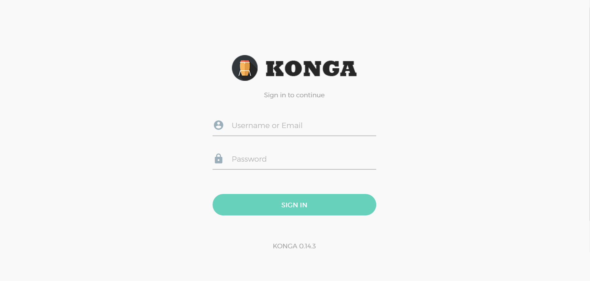
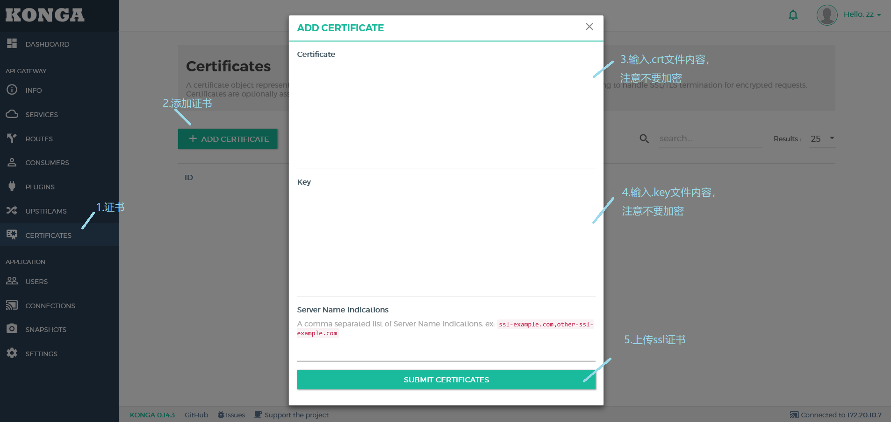
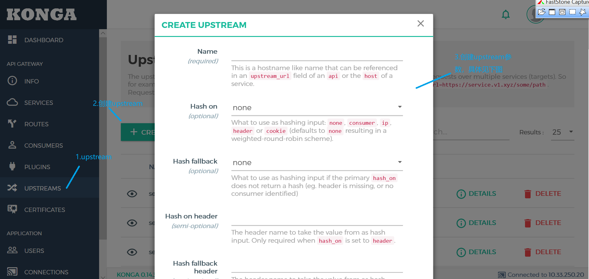
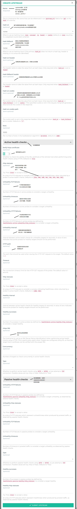
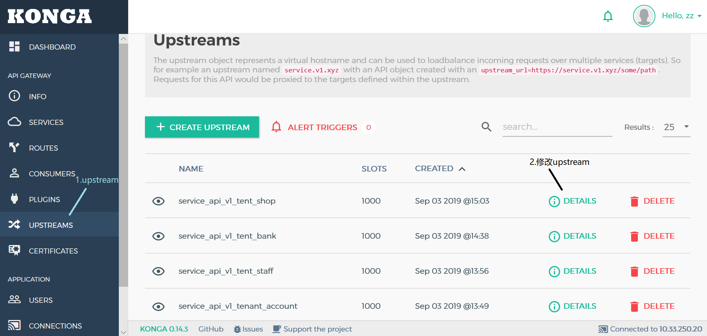
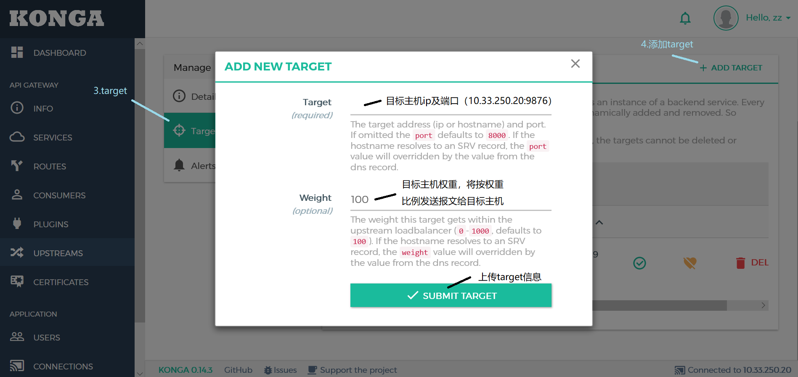
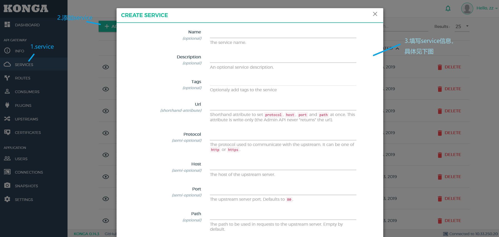
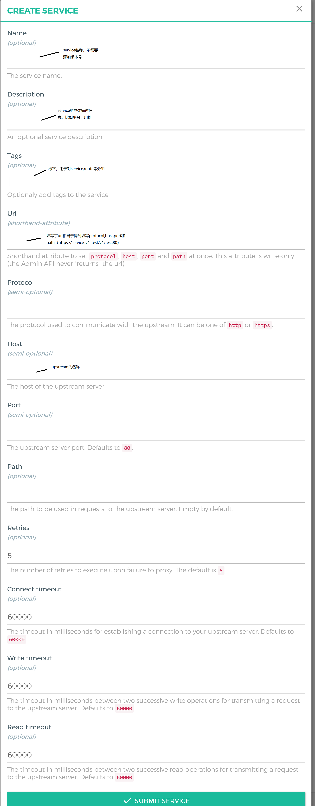
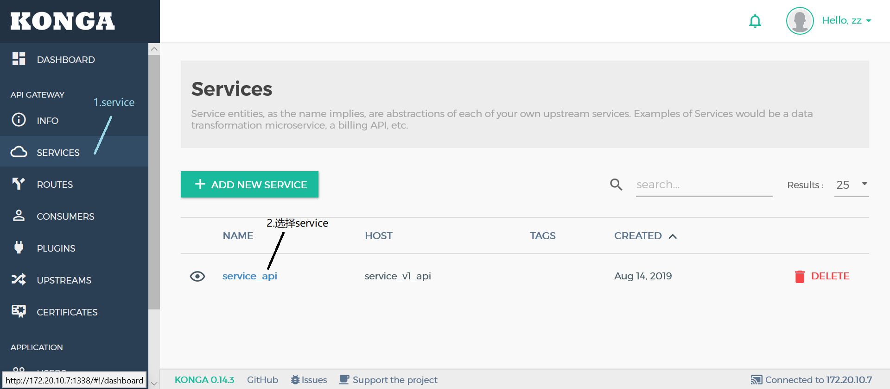
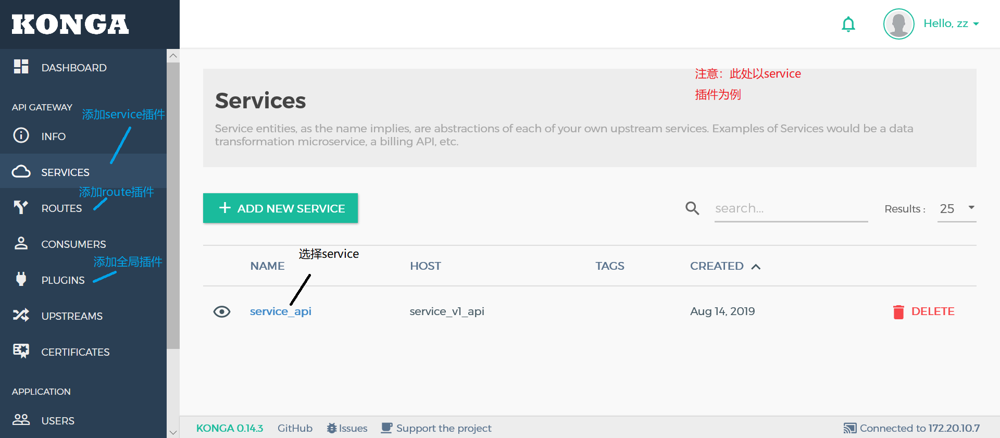

# konga-reference
konga的使用手册 详见https://github.com/pantsel/konga

## 目录

- [**konga的特性与功能**](#konga的特性与功能)
- [**konga的依赖包**](#konga的依赖包)
- [**konga安装**](#konga安装)
- [**konga配置与运行**](#konga配置与运行)
- [**konga升级**](#konga升级)
- [**konga使用**](#konga使用)
  - [**添加ssl证书**](#添加ssl证书)
  - [**添加upstream**](#添加upstream)
  - [**添加target目标主机**](#添加target)
  - [**添加service**](#添加service)
  - [**添加route**](#添加route)
  - [**添加plugin**](#添加plugin)

## konga的特性与功能

  konga并非是kong的官方admin ui,与kong没有隶属关系。
  
  konga的功能有：
 
   - 管理kong admin api对象
   - 从远程数据库，文件，api导入使用者
   - 管理多个kong节点
   - 使用快照备份，还原和迁移kong节点
   - 使用运行状况检查监视节点和 API 状态
   - 电子邮件和slack通知
   - 多个konga用户
   - 简单的数据库集成（MySQL、postgresSQL、MongoDB、SQL）
 
 ## konga的依赖包
  
  - Nodejs >= 8 (推荐8.11.3 LTS)
  - Npm
  - npm sails
  - npm gulp
  - npm bower
  
 ## konga安装
 ```bash
  #安装依赖库
  $ sudo yum install npm nodejs
  
  #如果npm与nodejs版本太旧，可以使用n更新
  $ sudo npm -g install n
  $ sudo n stable
  
  #安装依赖库
  $ sudo npm install -g sails
  $ sudo npm install -g gulp
  $ sudo npm install -g bower
  
  #下载安装konga
  $ git clone https://github.com/pantsel/konga.git
  $ cd konga
  $ npm i
 ```
 
 ## konga配置与运行
 ```bash
 # postgresql 增加konga数据库,用于存储konga用户信息
 $ sudo -u postgres psql
 $ create user konga superuser password konga; //创建用户与数据库
 $ create database konga owner konga;
 $ \q #退出
 
 #配置konga
 $ cp config/local.js.default config/local.js

  #config/local.conf 配置
	module: {
		connection: process.env.DB_ADAPTER || 'postgres',
	}

  #config/connect.js配置
	postgres: {
	...
	user: process.env.DB_USER || 'konga',
	password: process.env.DB_PASSWORD || 'konga',
	database: process.env.DB_DATABASE || 'konga'.
	...
	}
  
  #konga运行开发模式
  $ npm start #当出现空白页面时，运行 $ npm run bower-deps 
	$ nohup npm start &  #后台运行konga，不接收stdin，输出到nohup.out
	//关闭nohup npm start
	$ jobs //查看后台运行进程
	$ fg //然后ctrl+c
  
  #konga运行生产模式
  $ node ./bin/konga.js  prepare --adapter postgres --uri postgresql://localhost:5432/konga
  $ nohup npm run production &
 ```
 ## konga升级
 konga升级步骤：
  - 在开发模式下启动一次 
    - npm start
  - 然后启动生产模式 
    -  $ node ./bin/konga.js  prepare --adapter postgres --uri postgresql://localhost:5432/konga
    -  $ nohup npm run production
 
 ## konga使用
 
 [](https://github.com/zzhengzhuo/konga-reference/blob/master/konga.png)

 ### 添加ssl证书
 
 [](https://github.com/zzhengzhuo/konga-reference/blob/master/添加ssl证书.png)
 
 ### 添加upstream
 
 [](https://github.com/zzhengzhuo/konga-reference/blob/master/添加upstream.png)
 
 [](https://github.com/zzhengzhuo/konga-reference/blob/master/添加upstream参数.png)
 
 ### 添加target
 
 添加target目标主机。
 
 [](https://github.com/zzhengzhuo/konga-reference/blob/master/添加target.png)
 
 [](https://github.com/zzhengzhuo/konga-reference/blob/master/添加target参数.png)
 
 ### 添加service
 
 [](https://github.com/zzhengzhuo/konga-reference/blob/master/添加service.png)
 
 [](https://github.com/zzhengzhuo/konga-reference/blob/master/添加service参数.png)
 
 ### 添加route
 
 [](https://github.com/zzhengzhuo/konga-reference/blob/master/添加route.png)
 
 ### 添加plugin
 
 [](https://github.com/zzhengzhuo/konga-reference/blob/master/添加plugin.png)
 

 
